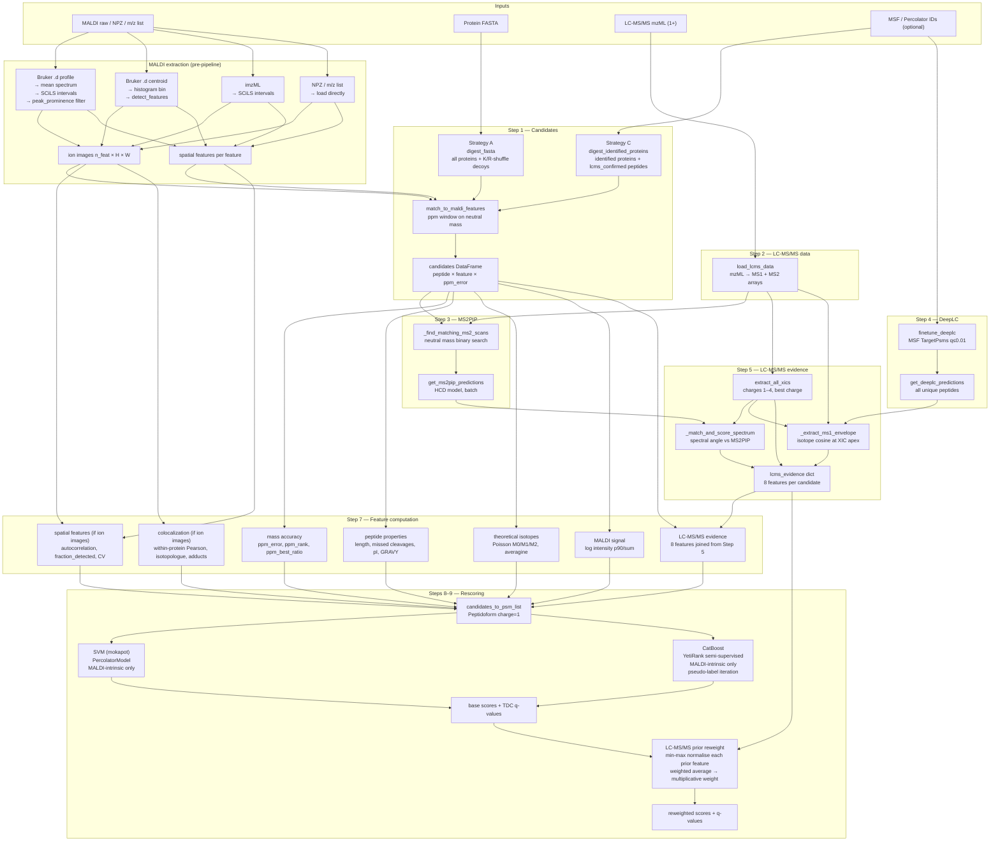

# MSI-PICASSO — Architecture

## Overview

MSI-PICASSO rescores MALDI-MSI MS1 features against a protein FASTA using symmetric target-decoy competition. LC-MS/MS mzML files provide optional prior evidence that reweights (but does not train) the final scores. The pipeline has two candidate generation strategies (A and C) and two rescoring backends (SVM and CatBoost).

---

## Data flow

```
MALDI raw data ──────────────────────────────────────────┐
  Bruker .d (profile)   →  mean spectrum  →  SCiLS       │
  Bruker .d (centroid)  →  histogram bin  →  detect_features
  imzML (profile/centroid) → SCiLS intervals             │
  NPZ / m/z list        →  pre-extracted features ───────┘
                                          │
                                   feature m/z list
                                   ion images (optional)
                                   spatial features (optional)
                                          │
FASTA ──── tryptic digest ───────────────┤
  forward + K/R-preserving               │
  shuffled decoys                         │
                         │               │
MSF (optional) ── identified ───── match_to_maldi_features
  proteins + peptides    │         (ppm window, neutral mass)
  Strategy C candidates ─┘               │
                                   candidates DataFrame
                                   (peptide × feature rows)
                                          │
LC-MS/MS mzML ────────────────────────────┤
  MS1 scans → XIC extraction             │
  MS2 scans → neutral mass match         │
  MS2PIP    → predicted spectra          │
  DeepLC    → predicted RT ──────── lcms_evidence
  (optional MSF finetune)                │
                                          │
                                   feature computation
                                          │
                                   PSMList + features
                                          │
                              ┌───────────┴───────────┐
                          SVM (mokapot)          CatBoost
                          MALDI-intrinsic         MALDI-intrinsic
                          features only           features only
                              └───────────┬───────────┘
                                          │
                                   base scores + q-values
                                          │
                              LC-MS/MS prior reweight
                              (multiplicative, post-hoc)
                                          │
                                   reweighted q-values
                                   result DataFrame
```

---

## Step-by-step pipeline (`pipeline.rescore`)



---

## Candidate generation strategies

```
Strategy A (default — no MSF)
  FASTA
    └── digest_fasta()
          ├── pyteomics: tryptic cleavage, max 2 missed, 7–35 aa
          ├── K/R-preserving protein shuffle → decoys
          └── Rust: mass, [M+H]+, n_C/H/N/O/S per peptide
    └── match_to_maldi_features()
          └── Rust: binary search, ppm window → candidates

Strategy C (MSF / Percolator IDs provided)
  MSF / Percolator IDs
    └── parse_lcms_ids()
          ├── proteins passing protein_fdr
          └── peptides passing peptide_fdr  →  LCMSIds(proteins, peptides)
    └── digest_identified_proteins()
          ├── digest identified proteins  →  protein_digest rows
          ├── directly identified sequences  →  lcms_confirmed rows
          │     (novel = not reachable by digest: peptide-level shuffle decoy)
          └── join LC-MS/MS evidence (q_value, score, n_psms, rt, intensity)
    └── match_to_maldi_features()
          └── same as Strategy A
```

---

## Feature groups

```
MALDI_INTRINSIC_FEATURES  ←  used to train the rescoring model
──────────────────────────────────────────────────────────────
Mass accuracy       ppm_error_abs, ppm_rank, ppm_best_ratio
Ambiguity           n_candidates, log_n_candidates
Protein             protein_n_features, protein_coverage,
                    protein_rank, protein_best_ratio
Peptide             peptide_length, n_missed_cleavages,
                    has_modifications, nterm_basic, peptide_pi, ...
MALDI signal        log_maldi_intensity, log_maldi_intensity_p90,
                    log_maldi_intensity_sum
Isotopes (theo)     theo_isotope_cosine/chi2/kl, averagine_deviation,
                    theo_m1/m2_ratio_diff
Ionisation          n_arginine, n_phenylalanine, gravy_score, charge_proxy
Spatial (optional)  spatial_autocorrelation, fraction_detected,
                    intensity_cv, log_mean_intensity, spatial_entropy
Colocalisation      protein_colocalization*, isotopologue_coloc*,
  (optional)        adduct_coloc*, spatial_morans_i, spatial_gearys_c
Isotope envelope    isotope_envelope_cosine*, isotope_m1/m2_ratio_diff*
  (optional)

LCMS_PRIOR_FEATURES  ←  excluded from training; applied post-hoc
─────────────────────────────────────────────────────────────────
mzML-derived        lcms_ms2_spectral_angle, lcms_ms2_n_matches,
                    lcms_xic_max_intensity, lcms_xic_n_scans,
                    lcms_xic_snr, lcms_xic_best_charge,
                    lcms_rt_residual, lcms_ms1_isotope_cosine
ID-derived          lcms_q_value, lcms_pep, lcms_score, n_psms,
  (Strategy C)      lcms_intensity
```

---

## Rescoring backends

```
Generative (probabilistic_scorer.py)
  Input : candidates DataFrame with all features
  Params: estimated label-free from best-ppm proxy (RMS half-normal sigma)
  Score : log Σ L_i where L_i are independent half-normal/normal likelihoods
            L_ppm      = exp(-½ (ppm_error_abs / σ_ppm)²)
            L_isotope  = exp(-½ ((1 - cosine) / σ_iso)²)
            L_ccs      = exp(-½ ((δCCS - μ) / σ)²)         [if CCS present]
            L_spatial  = exp(-½ ((SA - μ) / σ)²)            [if spatial present]
  Feats : generative_score, generative_score_rank, generative_score_gap, generative_score_z
  Post  : TDC q-values → LC-MS/MS prior reweight → reweighted q-values
  Note  : also runs as step 7b pre-scorer when model="svm"/"catboost"
          (compute_generative=True, default); its 4 ranking features then enter
          MALDI_INTRINSIC_FEATURES before training.

SVM (mokapot)
  Input : MALDI_INTRINSIC_FEATURES on PSMList (includes generative features if step 7b ran)
  Model : PercolatorModel (iterative SVM)
  Output: mokapot confidence object + raw scores for all PSMs
  Post  : TDC q-values → LC-MS/MS prior reweight → reweighted q-values

CatBoost (semi-supervised YetiRank)
  Input : MALDI_INTRINSIC_FEATURES (includes generative features if step 7b ran)
  Seed  : targets with ppm_error_abs < 2.0 AND theo_isotope_cosine > 0.7
  Loop  : train → predict → TDC q-values → expand to q ≤ 0.05 → repeat
           (max 5 iterations, stop when positive set changes < 1%)
  Post  : TDC q-values → LC-MS/MS prior reweight → reweighted q-values
```

---

## LC-MS/MS prior reweight

Applied identically after both SVM and CatBoost:

```
for each prior feature f in LCMS_PRIOR_FEATURES present in data:
    fill NaN with worst value (1.0 for q_value/pep, 0.0 for others)
    invert if lower-is-better (q_value, pep): value = 1 - value
    min-max normalise across all candidates → [0, 1]
prior_weight = mean of normalised features (per candidate)
reweighted_score = base_score × prior_weight
reweighted_q_value = TDC(reweighted_score)
```

---

## Module map

```
MSI-PICASSO/
├── cli.py                  Entry point; argument parsing; dispatches MALDI
│                           extraction and calls pipeline.rescore()
│
├── pipeline.py             rescore() — steps 1–9 orchestration
│                           compute_lcms_prior() — post-hoc reweighting
│
├── maldi_extraction.py     Bruker .d extraction via imzy
│   ├── _build_profile_mean_spectrum()
│   ├── detect_features()       centroid path (histogram bin + greedy merge)
│   ├── extract_ion_images()    fast TSF / profile cumsum / fallback
│   └── compute_spatial_features()  fraction_detected, Moran's I, CV, ...
│
├── maldi_imzml.py          imzML extraction via pyimzml
│   ├── SCiLSConfig          dataclass (peak_prominence, smoothing, ...)
│   ├── _build_mean_spectrum()   aligned fast path + general np.add.at path
│   ├── _detect_intervals()      SG smooth → find_peaks → valley-to-valley
│   ├── _integrate_pixel()       TIC-norm → sum or apex per interval
│   └── extract_scils_features() public entry point
│
├── candidates.py           Peptide DB construction + MALDI matching
│   ├── digest_fasta()           Strategy A
│   ├── digest_identified_proteins()  Strategy C
│   └── match_to_maldi_features()     Rust binary search
│
├── lcms_ids.py             Parse LC-MS/MS IDs (MSF / Percolator / mzIdentML)
│   └── parse_lcms_ids()
│
├── lcms_evidence.py        All LC-MS/MS feature extraction
│   ├── load_lcms_data()         mzML → MS1/MS2 arrays
│   ├── extract_all_xics()       Rust or Python XIC extraction, charges 1–4
│   ├── get_ms2pip_predictions() MS2PIP batch, HCD model
│   ├── get_deeplc_predictions() DeepLC batch, optional MSF finetune
│   └── compute_all_lcms_evidence()  per-feature pre-compute + per-candidate loop
│
├── feature_generator.py    Feature computation orchestration
│   ├── compute_all_features()   calls all maldi_features functions
│   ├── candidates_to_psm_list() → PSMList (charge always 1)
│   └── populate_psm_features()
│
├── maldi_features.py       MALDI-side feature functions
│   ├── compute_colocalization_features()    within-protein Pearson (BLAS)
│   ├── compute_isotopologue_colocalization()
│   ├── compute_adduct_colocalization()
│   ├── compute_spatial_autocorrelation_full()  Moran's I, Geary's C (threaded)
│   └── compute_theoretical_isotope_features()  vectorised Poisson
│
├── probabilistic_scorer.py Generative scoring model (no training)
│   ├── estimate_noise_params()   label-free sigma estimation from proxy set
│   ├── compute_generative_scores()  log-sum of ppm/isotope/CCS/spatial likelihoods
│   ├── add_ranking_features()    per-feature rank, gap, z-score
│   ├── estimate_fdr()            TDC q-values on winners per feature
│   └── run_generative_scoring()  convenience entry point
│
├── utils.py                Shared maths (isotope, mass conversions, ppm)
│
└── MSI-PICASSO-rs/          Rust extension (PyO3 + rayon)
    ├── digest.rs           compute_peptide_masses, match_mz
    ├── xic.rs              extract_xics_batch (parallel)
    ├── isotope.rs          extract_ms1_envelopes_batch
    ├── spectral.rs         spectral_angles_batch
    └── features.rs         ionisation + property features (parallel)
```

---

## Key design invariants

**Symmetric target-decoy**: no feature computation function takes `is_decoy` as a parameter. Targets and decoys pass through identical code paths.

**LC-MS/MS evidence is prior-only**: `LCMS_PRIOR_FEATURES` are never passed to the SVM or CatBoost trainer. They are applied as a multiplicative reweight after scoring. This prevents the model from learning to rank by LC-MS/MS identification quality rather than MALDI match quality.

**K/R-preserving protein shuffle**: decoy proteins are shuffled (not reversed) with K/R fixed in place, preserving tryptic cleavage sites. Shuffling (vs reversal) breaks elemental composition conservation at the peptide level, ensuring isotope features remain discriminative.

**Profile MALDI → SCiLS on mean spectrum**: profile Bruker .d data has ~337 K m/z points per spectrum; feeding this into histogram-based feature detection produces tens of thousands of spurious bins. Instead the mean spectrum is computed across all pixels and peak detection (SG smooth + `find_peaks` with prominence threshold) is applied once, producing ~700–2000 real features.
